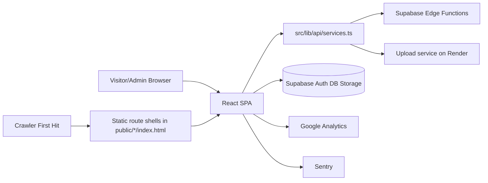

# Shoot For Arts Frontend
[](https://github.com/validayo/shootforarts-frontend/actions/workflows/ci.yml)

Production frontend for the Shoot For Arts photography site.

Stack: React + TypeScript + Vite + Tailwind + Supabase + Vercel.

## Live Demo

- Site: https://shootforarts.com

## Why This Project

I turned my photography passion into a real business and needed a website that matched the brand I had in mind. I also have a strong passion for software engineering, so instead of using WordPress templates or buying a prebuilt site, I chose to build the platform myself and combine both sides of who I am.

That decision let me design a custom experience and implement the exact workflows I needed: public portfolio pages, admin management tools, SEO structure, analytics, testing, and deployment controls. This project represents both my creative direction and my engineering mindset, and it proves I can build, operate, and improve the full product without platform limitations.

## Tech Stack

- Frontend: React 18, TypeScript, Vite, Tailwind CSS
- Data/Auth/Storage: Supabase
- Deployment: Vercel
- Monitoring: Sentry
- Testing: Vitest, Testing Library, Playwright, GitHub Actions CI

## Architecture



Backend services are maintained separately; this repository is the frontend application.

## Product Surfaces

- Public routes: `/`, `/about`, `/services`, `/contact`
- Admin routes: `/sfaadmin/login`, `/sfaadmin/dashboard`, `/sfaadmin/calendar`, `/sfaadmin/upload`, `/sfaadmin/gallery-manager`

## Main Data Flows

- Gallery: frontend -> `GET {BASE}/gallery` -> render gallery
- Contact: frontend -> `POST {BASE}/contact-form`
- Newsletter: frontend -> `POST {BASE}/newsletter`
- Admin uploads: frontend -> authenticated `POST {UPLOAD_BASE}/upload-photos`

## Security Snapshot

- Admin auth via Supabase session/JWT.
- Sensitive data protection is enforced with Supabase RLS and storage policies.
- `ProtectedRoute` is a UX gate, not the primary security boundary.
- Public forms use honeypot, minimum-fill-time, and cooldown protections.
- CSP and security headers configured in `vercel.json`.

## Performance Snapshot

- Gallery loads transformed thumbnails first.
- High-res media and heavy UI dependencies are lazy-loaded.
- Route-level code splitting in `src/App.tsx`.
- Static route shells in `public/` improve crawler-first metadata and initial SEO response.

## Quality and Testing

- CI workflow: `.github/workflows/ci.yml`
- Unit/component tests: `npm run test`
- E2E smoke tests: `npm run test:e2e:smoke`
- E2E full suite: `npm run test:e2e:full`
- Type checks: `npm run typecheck`
- Lint: `npm run lint`
- SEO contract checks: `npm run seo:validate`
- Lighthouse quality budgets: `.lighthouserc.json` via CI job `lighthouse-budgets`

## Local Development

```bash
npm install
npm run dev
```

Useful commands:

```bash
npm run lint
npm run typecheck
npm run test
npm run build
```

## Environment Variables

Use `VITE_*` only for values safe to expose to the client bundle.

- `VITE_SUPABASE_URL`: Supabase project URL
- `VITE_SUPABASE_ANON_KEY`: Supabase anon key
- `VITE_UPLOAD_BASE` (optional): upload service base URL
- `VITE_ENABLE_EDGE_SYNC` (optional): enable admin edge-sync behavior
- `VITE_GA_MEASUREMENT_ID` (optional): Google Analytics ID
- `VITE_SENTRY_DSN` (optional): Sentry DSN
- `VITE_SENTRY_ENVIRONMENT` (optional): Sentry environment label
- `VITE_SENTRY_ENABLE_DEV` (optional): enable Sentry in local/dev
- `VITE_HCAPTCHA_SITE_KEY` (optional): hCaptcha site key for admin login challenge
- `VITE_ADMIN_HCAPTCHA_VERIFY_URL` (optional): server endpoint that verifies hCaptcha tokens
- `VITE_ADMIN_HCAPTCHA_ENFORCE_SERVER_VERIFY` (optional): require server verification before login (`true`/`false`)

## Project Map

- `src/pages/public/`: public route pages
- `src/pages/admin/`: admin route pages
- `src/components/`: feature and shared UI
- `src/lib/api/`: API wrappers
- `src/lib/supabase/`: Supabase client setup
- `src/lib/security/`: client anti-abuse helpers
- `public/`: static assets and SEO route shells
- `supabase/migrations/`: schema and policy history used by this frontend
- `tests/e2e/`: Playwright specs

## Deployment

- Frontend deploy target: Vercel
- Config and headers: `vercel.json`
- External dependencies: Supabase and upload backend service

## Quick File Guide

- App shell and routes: `src/App.tsx`
- Gallery behavior: `src/components/gallery/Gallery.tsx`
- Contact form: `src/components/contact/ContactForm.tsx`
- Newsletter flows: `src/components/newsletter/`
- Admin dashboard: `src/pages/admin/AdminPage.tsx`
- Admin gallery manager route shell: `src/pages/admin/AdminGalleryManagerPage.tsx`
- Admin gallery manager module: `src/components/admin/AdminGalleryManager.tsx`
- API service layer: `src/lib/api/services.ts`
- Auth/session helpers: `src/lib/auth/session.ts`, `src/contexts/AuthContext.tsx`
- SEO component: `src/components/seo/SEO.tsx`
- Sitemap generation: `scripts/generate-sitemaps.mjs`

## Additional Docs

- Frontend technical deep dive: `docs/frontend-deep-dive.md`
- SEO checklist: `docs/seo-validation-checklist.md`
- Analytics checklist: `docs/analytics-conversions-checklist.md`
- Ops runbook: `docs/ops-runbook.md`
- Admin login hardening: `docs/admin-login-security.md`
- Changelog: `docs/changes.md`

Copyright (c) 2026 Shoot For Arts. All rights reserved.
No permission is granted to use, copy, modify, or distribute this code.
