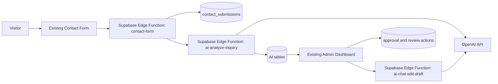

# Shoot For Arts AI Admin Add-On Implementation Plan

## 1. Purpose

I wrote this document to define the chosen direction for the Shoot For Arts AI admin add-on.

My goal is to fit AI into the current project with the least disruption:

- use OpenAI inside the existing Supabase backend
- keep a human-review workflow for every recommendation and draft
- extend the current admin dashboard instead of redesigning it
- keep the contact form and current admin routes working exactly as they do now

I use this document for two purposes:

- record the chosen direction and constraints for the AI admin add-on
- record the current rollout state so future work stays scoped

I am not using this document to authorize a frontend redesign, autonomous sending, or a new standalone AI product surface.

---

## 2. Decision Summary

I want the project to move forward with this setup:

- main model for inquiry drafting and admin AI chat: `gpt-5.4-mini`
- optional later optimization for cheap extraction/classification: `gpt-5.4-nano`
- architecture: current frontend -> Supabase Edge Function -> Supabase DB -> current admin dashboard
- workflow: AI summarizes, recommends, and drafts; admin reviews, edits, approves, and sends
- UI approach: add a new admin module/tab/card inside the current admin surface, not a redesign

I want the MVP to use one main model first. `gpt-5.4-nano` is a later optimization only after the workflow is stable and measurable.

---

## 2.1 Current rollout state

As of `2026-04-19`, I had already moved this project beyond pure planning.

Current working state:

- Phase 1 is working end to end:
  - inquiry submission
  - backend AI analysis
  - recommendation storage
  - initial draft generation
  - admin dashboard AI summary/list/detail rendering
- a narrow Phase 2A review flow is also live:
  - edit draft
  - approve draft
  - copy draft
  - manually send outside the app
  - mark as sent inside the admin

My current deliberate product choice:

- live in-app provider send is not the primary admin path right now
- the active workflow is still human-controlled manual send confirmation

---

## 3. Current Project Fit

This repo already gives me the right structure for an additive AI admin layer:

- admin routes already live under `/sfaadmin/*`
- `src/pages/admin/AdminPage.tsx` already works as the route entry for the dashboard, calendar, and upload surfaces
- `src/features/admin/dashboard/pages/AdminDashboardPage.tsx` already coordinates those admin surfaces in the current feature-first structure
- `src/features/admin/shared/components/AdminShellLayout.tsx` provides the existing admin shell and navigation
- `src/features/admin/data/components/AdminData.tsx` already works as the main inquiry/subscriber admin surface
- `src/lib/api/services.ts` already centralizes frontend API calls and direct Supabase reads
- admin auth already uses Supabase session state through `src/contexts/AuthContext.tsx`
- inquiry data already lands in `contact_submissions`
- workflow state already has a pattern via `admin_booking_workflow`

The current contact flow also gives me a strong source record for AI. Existing submissions already include fields such as:

- `service`
- `service_tier`
- `occasion`
- `date`
- `time`
- `location`
- `instagram`
- `referralSource`
- `add_ons`
- `pinterestInspo`
- `questions`
- `extra_questions`

That means I want the AI layer to augment the current workflow, not replace it.

---

## 4. Product Principles

### 4.1 Additive UI only

For the MVP, I want to preserve the current admin structure and styling.

What I want here:

- keep `AdminShellLayout`
- keep the current sidebar and route model
- keep `/sfaadmin/dashboard` as the primary home for the feature
- add cards, tabs, badges, drawers, and detail sections only where needed
- not replace the current inquiry list with a chat-first interface

### 4.2 Human review is the control point

I am comfortable letting the AI:

- summarize inquiries
- extract useful details
- recommend a matching service/tier or custom quote path
- draft replies
- rewrite drafts based on admin instructions

By default, I do not want the AI to:

- send an email automatically
- approve its own draft
- hide or overwrite the raw submission
- invent services or pricing outside approved business rules

### 4.3 Backend-owned AI

I want all OpenAI calls to live in the Supabase backend, not in the browser.

That gives me:

- API keys off the client
- validation centralized
- logging consistent
- retries and idempotency server-side

### 4.4 Structured business grounding

I do not want the model working from prompt text alone.

I want it grounded with:

- a server-side service/tier catalog
- pricing and escalation rules
- the raw contact submission
- any existing workflow status that matters for admin context

---

## 5. Target Workflow

### 5.1 Inquiry intake

1. A visitor submits the existing contact form.
2. The existing `contact-form` flow stores the submission in `contact_submissions`.
3. A backend AI function analyzes the new inquiry.
4. The backend stores a structured analysis and an initial draft reply.
5. The dashboard shows the inquiry with AI summary, recommendation, and draft state.

### 5.2 Admin review

1. The admin opens the dashboard.
2. A lightweight AI summary card shows what is new since the last review.
3. Each inquiry can show:
   - raw submission
   - AI summary
   - recommended service/tier or custom quote path
   - rationale
   - latest draft
4. The admin can:
   - edit the draft
   - approve the draft
   - copy the draft
   - send manually outside the system
   - mark the draft as sent for auditability

### 5.3 Current send stance

Right now I am using manual send confirmation, not live send from the dashboard.

Why I am doing that:

- lower operational risk
- avoids duplicate-send/provider edge cases while the workflow is still settling
- keeps the human review step explicit

### 5.4 Later send flow

Later, after the review workflow is stable, I can add one of:

- create-email-draft support
- explicit send-from-dashboard behind a feature flag
- reply ingestion and follow-up suggestions

That is not part of my current approved path.

---

## 6. Architecture I Am Using

### 6.1 Why this is the right fit

This matches the project I already have:

- the frontend stays a React/Vite app with its current admin shell
- Supabase remains the auth, data, and serverless boundary
- the current contact form remains the system of record for lead intake
- AI becomes a backend add-on, not a new stack

### 6.2 Trigger strategy I prefer

My preferred order:

1. run AI analysis from the backend immediately after a successful contact submission insert
2. support a manual re-run path from admin
3. add scheduled backfill only if needed later

If the existing backend repo cannot safely trigger AI inline at first, my fallback is:

- store the submission normally
- expose a manual "Analyze" action in admin
- add automatic triggering later

---

## 7. UI Integration Plan

I want the MVP to live inside the current dashboard route and component model.

### 7.1 MVP placement

My primary placement:

- add an AI summary card near the top of the dashboard
- add AI badges and status indicators to the inquiry list
- add AI sections to the existing inquiry detail drawer/modal

My optional placement if I need more density:

- add an internal dashboard tab such as `Inbox` / `AI Review`

I do not want to add a new top-level sidebar item for the MVP unless the current dashboard becomes too crowded.

### 7.2 Suggested UI surfaces

#### A. AI summary card

Shows:

- number of new inquiries needing review
- number of drafts ready
- number of inquiries that need clarification or custom quote review

#### B. AI state in the inquiry list

Per inquiry:

- AI status
- recommended service/tier
- confidence label
- draft status

#### C. AI detail section inside the current inquiry view

Shows:

- raw submission
- normalized extracted details
- recommendation and rationale
- latest draft
- admin actions such as edit/approve/copy/mark-sent

Version history and review timeline are still valuable to me as audit data, but I want to treat them as secondary UI. Future UI cleanup can collapse or hide them by default rather than giving them persistent primary space.

#### D. Admin context + rewrite tools

The next useful extension for me is not a public chatbot.

It is an admin-only rewrite/context surface for instructions like:

- "shorten this"
- "make this warmer"
- "offer the smaller package"
- "ask for the missing date details"
- "rewrite this using the new info from my phone call"
- "regenerate this reply with the updated location and budget"

---

## 8. Model Strategy

### 8.1 MVP model choice

I want to use `gpt-5.4-mini` for:

- inquiry analysis
- recommendation reasoning
- initial reply drafting
- admin rewrite/chat actions

That keeps the MVP simpler for me:

- one prompt stack
- one quality bar
- one main telemetry surface

### 8.2 Later optimization

Only after the MVP is stable, I can optionally introduce `gpt-5.4-nano` for:

- basic extraction
- low-risk classification
- cheap background enrichment

I do not want to move final recommendation or reply drafting to `gpt-5.4-nano` unless I have validated the quality against real inquiries.

---

## 9. Delivery Phases

## Phase 0. Planning and backend contract

Deliverables:

- final schema and API contract
- service/tier catalog design
- review and approval states
- model configuration defaults
- feature flag plan

Exit criteria:

- the docs are approved
- no frontend or backend behavior changes yet

## Phase 1. AI analysis and draft MVP

Deliverables:

- backend AI analysis function
- AI tables
- initial dashboard card/list/detail integration
- versioned draft storage

Exit criteria:

- a new inquiry can produce a summary, recommendation, and draft
- the admin can review the result in the current dashboard
- no automatic sending exists

## Phase 2. Draft review workflow

Deliverables:

- draft editing
- approve action
- copy draft
- manual send confirmation
- quiet audit/version persistence

Exit criteria:

- the admin can refine drafts in the dashboard
- the admin can complete a manual send workflow without leaving the inquiry in a misleading state
- draft history remains auditable even if the main UI does not foreground it

## Phase 3. Context-aware rewrite and regenerate

Deliverables:

- admin context notes attached to an inquiry
- regenerate/rewrite actions that can use newly learned client details
- clearer handling of "client called/texted with more info" scenarios
- versioning that stays mostly in the background

Exit criteria:

- the admin can update context and request a better draft without losing prior draft state
- the system remains human-reviewed and auditable

## Phase 4. Inquiry assistant

Deliverables:

- inquiry-aware assistant/chat surface for internal admin use
- help with wording, pricing guidance, clarifying questions, and planning suggestions
- grounded recommendations tied to the actual inquiry record and approved business context

Exit criteria:

- the assistant is clearly internal-only
- outputs stay grounded to the inquiry and business rules
- it helps the admin continue the conversation rather than replacing judgment

## Phase 5. Ops automation

Deliverables:

- invoice/contract generation support
- template filling from inquiry and booking context
- later operational automations that sit after the inquiry workflow is proven

Exit criteria:

- operational automation saves real admin time without obscuring human control

## Phase 6. Cost optimization

Deliverables:

- optional `gpt-5.4-nano` usage for selected low-risk tasks
- model routing controls
- cost and quality comparison logs

Exit criteria:

- optimization lowers cost without hurting recommendation or draft quality

---

## 10. Repo Touchpoints For Future Implementation

These are the most likely frontend touchpoints when implementation starts:

- `src/pages/admin/AdminPage.tsx`
- `src/features/admin/dashboard/pages/AdminDashboardPage.tsx`
- `src/features/admin/data/components/AdminData.tsx`
- `src/features/admin/shared/components/AdminShellLayout.tsx`
- `src/lib/api/services.ts`
- `src/utils/types.ts`

Likely new frontend components:

- `src/features/admin/assistant/components/AdminAISummaryCard.tsx`
- `src/features/admin/assistant/components/AdminAIInsightSection.tsx`
- `src/features/admin/assistant/components/AdminAssistant.tsx`

Likely backend additions in the Supabase/backend side:

- AI edge functions
- AI tables and policies
- prompt and rule configuration

My key point here is scope control: I want to add the AI module to the current system rather than creating parallel admin infrastructure.

---

## 11. Out of Scope For MVP

- public-facing AI chat
- autonomous sending
- inbox sync
- calendar automation
- CRM replacement
- redesign of the admin shell
- replacing `admin_booking_workflow` with AI-owned state

My current non-goal clarification:

- a generic freeform public chatbot is not the next step
- I want the nearer-term AI expansion to stay anchored to existing inquiries and admin workflow

---

## 12. Acceptance Criteria

I want to judge the docs and eventual implementation against these outcomes:

- the feature clearly uses OpenAI through Supabase backend functions
- `gpt-5.4-mini` is the main model for draft and admin AI interactions
- human review is required before anything is sent
- the admin UI remains recognizably the same
- the existing inquiry workflow still works if AI is disabled or failing
