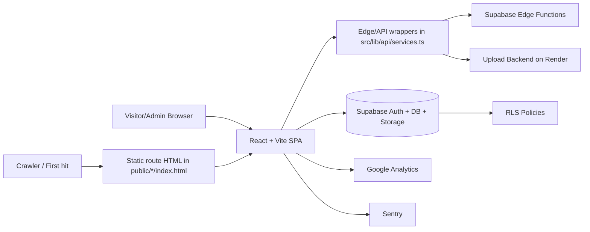
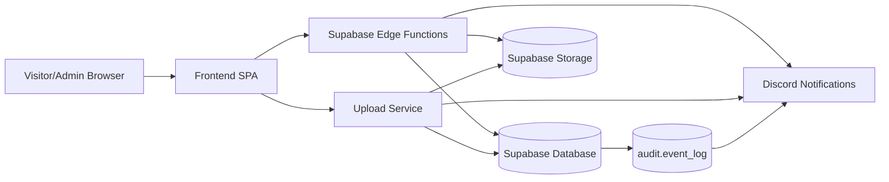

# Shoot For Arts Frontend Deep Dive

Production frontend for the Shoot For Arts photography site.  
Stack: React + TypeScript + Vite + Tailwind + Supabase + Vercel.

Detailed architecture and implementation reference retained from the original long-form README.

## Quick Start (Repo Orientation)

- Start here: [Architecture Diagram](#architecture-diagram), then [Key Engineering Decisions + Tradeoffs](#key-engineering-decisions--tradeoffs)
- Key flows: [Data path summary](#data-path-summary) and [Security and Abuse Controls](#14-security-and-abuse-controls)
- QA: CI workflow in [ci.yml](../.github/workflows/ci.yml) and tests under `tests/` and `src/`

Environment configuration values are intentionally omitted. Review this repo via source, tests, and CI.

Copyright (c) 2026 Shoot For Arts. All rights reserved.
No permission is granted to use, copy, modify, or distribute this code.

## Quick Links

- [Demo](#demo)
- [Architecture Diagram](#architecture-diagram)
- [Backend Overview (Private Repo Summary)](#backend-overview-private-repo-summary)
- [Key Engineering Decisions + Tradeoffs](#key-engineering-decisions--tradeoffs)
- [Threat Model Summary](#threat-model-summary)
- [Runtime Architecture](#2-runtime-architecture)
- [Project Structure](#3-project-structure)
- [Testing](#testing)
- [Deployment and Hosting](#13-deployment-and-hosting)
- [Security and Abuse Controls](#14-security-and-abuse-controls)
- [Quick "Where Do I Change X?" Guide](#17-quick-where-do-i-change-x-guide)

## Demo

Live: https://shootforarts.com  
GIF: coming soon

## Architecture Diagram

## Backend Overview (Private Repo Summary)

This frontend integrates with a separately maintained backend repository.  
The summary below is intentionally high-level and documents ownership and boundaries without exposing operational blueprint details.

### High-level architecture

### Backend responsibilities

- Contact: validates and persists inquiry submissions, then emits operational notifications.
- Newsletter: handles subscriptions and protected subscriber access paths for admin workflows.
- Gallery: serves ordered photo datasets for public rendering (including prioritized selections).
- Uploads: processes admin-uploaded images, stores optimized assets, and records photo metadata.

### Asset optimization

Uploaded images are normalized and optimized server-side to ensure consistent formats and efficient delivery across the site.

### Security model

- Admin operations require authenticated JWT context.
- Database and storage RLS policies are the primary enforcement boundary.
- Frontend route guards improve UX flow only; they are not the data-security boundary.
- Sensitive actions are enforced server-side and at the database policy layer.

### Observability

- Discord is used for operational notifications and error signaling across backend surfaces.
- Database mutation auditing is recorded in an audit table (`audit.event_log`).
- Audit events are forwarded to Discord for near-real-time visibility.

## Key Engineering Decisions + Tradeoffs

- Direct Supabase reads for admin data with optional Edge sync fallback. Tradeoff: fewer backend layers, more frontend merge/fallback logic.
- Lazy-loaded gallery dependencies (`react-masonry-css`, lightbox, motion, zoom plugin). Tradeoff: faster first load, more runtime orchestration.
- Centralized API wrapper in [`src/lib/api/services.ts`](../src/lib/api/services.ts). Tradeoff: consistent network layer, but needs periodic splitting as it grows.
- Layered anti-spam controls (honeypot + minimum fill time + cooldown) plus backend validation. Tradeoff: better abuse resistance, but client checks are not security boundaries.
- GA + Sentry configured via environment variables. Tradeoff: cleaner config management, but stricter deployment env hygiene.

## Threat Model Summary

See [Security and Abuse Controls](#14-security-and-abuse-controls) for implementation details and policy references.

- Protected assets:
  - Admin-only actions (uploads, photo ranking, deletion).
  - Contact submissions and newsletter subscriber data.
- Primary controls:
  - Supabase auth for admin sign-in.
  - RLS policies on sensitive tables/storage.
  - Route guards for UX routing only.
  - CSP and security headers from [`vercel.json`](../vercel.json).
  - Form anti-spam controls on public forms.
- Intentionally public:
  - Portfolio images rendered on public pages.
  - Marketing page metadata and static route shells in [`public/`](../public/).

## Performance Notes

- Gallery uses transformed thumbnails first, then fetches high-resolution images only when opening lightbox.
- Heavy client libraries are lazy-loaded to reduce initial JS.
- Route pages are lazy-loaded in [`src/App.tsx`](../src/App.tsx) and rendered with suspense fallback.
- Static SEO route shells in [`public/`](../public/) improve crawler first paint while SPA hydrates.
- Public route cache headers are set in [`vercel.json`](../vercel.json).

## 1) What This App Is

The site has two major surfaces:
- Public marketing/portfolio pages:
  `/, /about, /services, /contact`
- Admin surface:
  `/admin/login, /admin/dashboard, /admin/gallery-manager`

Core capabilities:
- Portfolio gallery with category filtering and lightbox.
- Services and package/tier display with CTA into contact form.
- Contact inquiry flow with anti-spam controls.
- Newsletter signup in footer and popup.
- Admin auth, inquiry/subscriber management, export, calendar view, and photo management.

## 2) Runtime Architecture

### Frontend runtime
- Single-page app bootstrapped at [`index.html`](../index.html) + [`src/main.tsx`](../src/main.tsx).
- Router and page composition in [`src/App.tsx`](../src/App.tsx).
- Global layout shell in [`src/components/layout/Layout.tsx`](../src/components/layout/Layout.tsx).
- Route-level SEO metadata set dynamically by [`src/components/seo/SEO.tsx`](../src/components/seo/SEO.tsx).
- Route analytics + robots noindex handling for admin routes in [`src/components/routing/RouteChangeTracker.tsx`](../src/components/routing/RouteChangeTracker.tsx).

### External backend surfaces used by frontend
- Supabase project:
  auth, database tables, storage, and policies.
- Supabase Edge Functions base:
  configured via frontend environment variables and consumed by [`src/lib/api/services.ts`](../src/lib/api/services.ts).
- Dedicated upload backend (Render):
  configured via `VITE_UPLOAD_BASE`.

### Data path summary
- `BASE` below refers to the Supabase Edge Functions base defined in [`src/lib/api/services.ts`](../src/lib/api/services.ts).
- Gallery reads:
  frontend -> `GET {BASE}/gallery?...` -> rendered on homepage gallery.
- Contact submit:
  frontend -> `POST {BASE}/contact-form`.
- Newsletter submit:
  frontend -> `POST {BASE}/newsletter`.
- Admin data:
  direct Supabase table reads (`contact_submissions`, `newsletter_subscribers`) and optional protected edge sync when enabled.
- Admin upload:
  authenticated `POST {UPLOAD_BASE}/upload-photos`.
- Admin gallery manager:
  direct Supabase `photos` table and storage object operations.

## 3) Project Structure

Top-level:
- `src/`: application code.
- `public/`: static assets + crawler-friendly route entry HTML + robots/sitemaps.
- `scripts/`: SEO and sitemap build/validation scripts.
- `docs/`: manual operational checklists.
- `tests/e2e/`: Playwright end-to-end specs.
- `.github/workflows/`: CI pipeline definitions.
- `supabase/migrations/`: schema and RLS policy history.
- `vercel.json`: rewrites/headers for deployment.

`src/` map:
- `src/main.tsx`: React mount.
- `src/App.tsx`: lazy-loaded routes, auth provider, route guards.
- `src/pages/public/`: public route pages.
- `src/pages/admin/`: admin route pages.
- `src/components/admin/`: admin-only UI modules.
- `src/components/layout/`: site chrome modules (layout, navbar, footer).
- `src/components/about/`: about-page feature components.
- `src/components/services/`: services-page feature components.
- `src/components/gallery/`: gallery feature components.
- `src/components/contact/`: contact feature components.
- `src/components/newsletter/`: newsletter feature components.
- `src/components/routing/`: route guard and route side-effect components.
- `src/components/seo/`: metadata and SEO components.
- `src/components/fun/`: optional fun/engagement UI.
- `src/components/ui/`: generic reusable UI primitives.
- `src/lib/api/`: API service wrappers.
- `src/lib/analytics/`: analytics event helpers.
- `src/lib/auth/`: auth/session helpers.
- `src/lib/security/`: form protection helpers.
- `src/lib/supabase/`: Supabase client + compatibility helpers.
- `src/contexts/`: auth context state.
- `src/utils/types.ts`: shared types.
- `src/utils/options.ts`: shared option lists/constants.
- `src/utils/admin/`: admin helper transforms.
- `src/utils/index.ts`: barrel exports for types/options.

## 4) Routes and What Each One Does

### Public routes
- `/` -> [`src/pages/public/HomePage.tsx`](../src/pages/public/HomePage.tsx)
  Renders `NewsletterPopup` and `Gallery`.
- `/about` -> [`src/pages/public/AboutPage.tsx`](../src/pages/public/AboutPage.tsx)
  Renders branded/about content from [`src/components/about/About.tsx`](../src/components/about/About.tsx).
- `/services` -> [`src/pages/public/ServicesPage.tsx`](../src/pages/public/ServicesPage.tsx)
  Shows package sections with accordion tiers, per-service "Book Now" actions, FAQ JSON-LD injection, videography note, and CTA to contact.
- `/contact` -> [`src/pages/public/ContactPage.tsx`](../src/pages/public/ContactPage.tsx)
  Renders contact intro copy + [`src/components/contact/ContactForm.tsx`](../src/components/contact/ContactForm.tsx).

### Admin routes
- `/admin/login` -> [`src/pages/admin/AdminLoginPage.tsx`](../src/pages/admin/AdminLoginPage.tsx)
  Supabase email/password login.
- `/admin/dashboard` -> [`src/pages/admin/AdminPage.tsx`](../src/pages/admin/AdminPage.tsx) (protected)
  Tabs for [`AdminData`](../src/components/admin/AdminData.tsx), calendar of inquiries, and uploader.
- `/admin/gallery-manager` -> [`src/components/admin/AdminGalleryManager.tsx`](../src/components/admin/AdminGalleryManager.tsx) (protected)
  Top picks, seasonal picks, category browser, delete/toggle/reorder management.

Routing details:
- Auth provider wraps app in [`src/App.tsx`](../src/App.tsx).
- [`src/components/routing/ProtectedRoute.tsx`](../src/components/routing/ProtectedRoute.tsx) redirects unauthenticated users to `/admin/login`.
- `/admin` auto-redirects to login or dashboard based on current auth session.
- `*` fallback redirects unknown paths to `/`.

## 5) Key Feature Modules

### Gallery ([`src/components/gallery/Gallery.tsx`](../src/components/gallery/Gallery.tsx))
- Uses `getGallery()` from [`src/lib/api/services.ts`](../src/lib/api/services.ts).
- Initial load fetches transformed thumbnails.
- On lightbox open, it lazily fetches higher resolution images and loads zoom plugin.
- Uses lazy imports for Masonry/lightbox/framer-motion chunks to improve initial load.
- Tracks gallery category views via analytics.

### Contact form ([`src/components/contact/ContactForm.tsx`](../src/components/contact/ContactForm.tsx))
- Dynamic form options based on selected service/tier from [`src/utils/options.ts`](../src/utils/options.ts).
- Includes anti-spam protections from [`src/lib/security/formProtection.ts`](../src/lib/security/formProtection.ts):
  honeypot field, minimum fill time, localStorage cooldown window.
- Submits to `submitContact()` in [`src/lib/api/services.ts`](../src/lib/api/services.ts).
- Tracks start/success/error analytics events.
- Supports prefill via query string:
  `/contact?service=...` (used by services page Book Now buttons).

### Newsletter ([`src/components/newsletter/Newsletter.tsx`](../src/components/newsletter/Newsletter.tsx), [`src/components/newsletter/NewsletterPopup.tsx`](../src/components/newsletter/NewsletterPopup.tsx))
- Both use the same backend subscribe API.
- Both use anti-spam + cooldown protection.
- Popup display logic:
  opens after delay or 50% scroll, suppressed per session and optionally across days with localStorage/sessionStorage keys.

### Admin dashboard ([`src/pages/admin/AdminPage.tsx`](../src/pages/admin/AdminPage.tsx), [`src/components/admin/AdminData.tsx`](../src/components/admin/AdminData.tsx))
- Dashboard stats and tables for contacts/subscribers.
- Search + filtering + date windows.
- CSV export for contacts/subscribers.
- Calendar view with selectable events + quick "Add to Google Calendar" deep-link.
- Optional edge sync mode when `VITE_ENABLE_EDGE_SYNC=true`.

### Admin uploader ([`src/components/admin/AdminUpload.tsx`](../src/components/admin/AdminUpload.tsx))
- Multi-image upload with previews and per-file progress via XHR.
- Enforces client-side type and max size validation (13 MB/file).
- Requires valid Supabase access token from current session.
- Sends multipart form-data to external upload service.

### Admin gallery manager ([`src/components/admin/AdminGalleryManager.tsx`](../src/components/admin/AdminGalleryManager.tsx))
- Pulls top/season/all photo lists from Supabase.
- Drag-and-drop ordering with `react-dnd`.
- Persists top and seasonal ranks.
- Assigns/removes top flag and season tags.
- Deletes both storage object (if resolvable) and DB record.

## 6) Data and Service Layer

Main API wrapper:
- [`src/lib/api/services.ts`](../src/lib/api/services.ts)

Functions exposed:
- `submitContact(payload)`
- `subscribe(email)`
- `getGallery(category, transforms, extra)`
- `uploadPhotos(category, files)`
- `getTopPhotos(category?)`
- `getSeasonPhotos(season, category?)`
- `getAllPhotos(category?)`
- `setTop(id, value)`
- `setSeasonTag(id, season)`
- `saveTopOrder(updates)`
- `saveSeasonOrder(updates)`
- `deletePhoto(photoOrId)`
- `getContactSubmissions()`
- `getNewsletterSubscribers()`

Auth helpers:
- [`src/lib/auth/session.ts`](../src/lib/auth/session.ts)
- [`src/contexts/AuthContext.tsx`](../src/contexts/AuthContext.tsx)

Supabase client:
- singleton client in [`src/lib/supabase/client.ts`](../src/lib/supabase/client.ts)
- re-exported in:
  [`src/lib/supabase/index.ts`](../src/lib/supabase/index.ts)

## 7) Environment Variables

Used in frontend code:
- Core: `VITE_SUPABASE_URL`, `VITE_SUPABASE_ANON_KEY`
- Optional: `VITE_UPLOAD_BASE`, `VITE_ENABLE_EDGE_SYNC`, `VITE_GA_MEASUREMENT_ID`, `VITE_SENTRY_DSN`, `VITE_SENTRY_ENVIRONMENT`, `VITE_SENTRY_ENABLE_DEV`

Important:
- `VITE_*` variables are injected into the client bundle at build time. Do not store private server secrets in `VITE_*`.
- Values are intentionally omitted for security and because this repo is intended for review, not third-party deployment.

## 8) Development Notes

- Keep changes scoped and update tests when behavior changes.
- Before pushing: `npm run lint`, `npm run typecheck`, `npm run test`, `npm run build`.
- CI must pass.
- `postbuild` automatically regenerates [`public/sitemap.xml`](../public/sitemap.xml) and [`public/sitemap-images.xml`](../public/sitemap-images.xml).
- Vite dev proxy is configured in [`vite.config.ts`](../vite.config.ts) for `/contact-form`, `/newsletter`, `/upload-photos`, `/images`.
- Playwright uses [`playwright.config.ts`](../playwright.config.ts) and auto-starts a local server for `npm run test:e2e`.

### Testing

- Unit + component tests: Vitest (`npm run test`)
- End-to-end tests: Playwright (`npm run test:e2e`)
- Current e2e coverage includes contact submission happy path plus honeypot spam rejection.

## 9) SEO Strategy

There are two SEO layers:
- Dynamic SPA metadata via [`src/components/seo/SEO.tsx`](../src/components/seo/SEO.tsx).
- Static route entry HTML pages for crawler-first metadata:
  [`public/about/index.html`](../public/about/index.html), [`public/services/index.html`](../public/services/index.html), [`public/contact/index.html`](../public/contact/index.html).

These static pages:
- include canonical/OG/Twitter tags,
- include JSON-LD breadcrumbs,
- include GA init,
- then dynamically inject the main SPA script/styles from `/index.html`.

SEO scripts:
- [`scripts/generate-sitemaps.mjs`](../scripts/generate-sitemaps.mjs)
  builds page and image sitemaps.
- [`scripts/validate-seo.mjs`](../scripts/validate-seo.mjs)
  checks required meta/canonical/GA/robots lines.

See also:
- [`docs/seo-validation-checklist.md`](../docs/seo-validation-checklist.md)

## 10) Analytics Strategy

GA bootstrapping:
- [`public/ga-init.js`](../public/ga-init.js) (reads `VITE_GA_MEASUREMENT_ID` from root [`index.html`](../index.html) meta tag and reuses it across static route shells).

Event wrappers:
- [`src/lib/analytics/events.ts`](../src/lib/analytics/events.ts)

Common tracked events:
- `page_view`
- `gallery_view`
- `contact_form_started`
- `contact_submit`
- `generate_lead`
- `newsletter_subscribe_success`
- `sign_up`
- `outbound_click`
- `service_book_now`
- `select_promotion`
- popup open/close and joke interactions

Setup checklist:
- [`docs/analytics-conversions-checklist.md`](../docs/analytics-conversions-checklist.md)

## 11) Observability

- Sentry initialization:
  [`src/lib/observability/sentry.ts`](../src/lib/observability/sentry.ts) (enabled only when `VITE_SENTRY_DSN` is set).
- Structured admin logging:
  [`src/lib/observability/logger.ts`](../src/lib/observability/logger.ts).
- Admin actions log key events for auth, uploads, gallery edits, sync fallback, and exports.

## 12) Styling System

Primary styling:
- Tailwind CSS with custom theme extension in [`tailwind.config.js`](../tailwind.config.js).
- Shared utility/component classes in [`src/index.css`](../src/index.css).

Notable custom classes:
- `.container-custom`
- `.nav-link` / `.nav-link-active`
- `.input-field`
- masonry helpers for gallery grid
- `.loader`
- mobile menu transition classes

Fonts:
- Cormorant Garamond (serif)
- Inter (sans)

## 13) Deployment and Hosting

Primary deployment target:
- Vercel (see [`vercel.json`](../vercel.json)).

[`vercel.json`](../vercel.json) behavior:
- redirects `/home` -> `/`
- rewrites `/admin` and `/admin/*` to `/index.html` (SPA handling)
- route-specific cache headers for public pages
- global security headers, including a baseline Content Security Policy (CSP)

CI pipeline:
- GitHub Actions workflow at [`.github/workflows/ci.yml`](../.github/workflows/ci.yml)
- jobs: lint, typecheck, build, unit/component tests, Playwright e2e
- optional preview deploy verification job (runs only when Vercel secrets are present)

Other infrastructure:
- Supabase project for auth/database/storage/edge functions.
- Render backend for upload endpoint.

## 14) Security and Abuse Controls

Current client-side protections:
- hidden honeypot fields (contact/newsletter forms),
- minimum-fill-time threshold,
- cooldown windows via localStorage timestamps.

Auth controls:
- admin routes gated by Supabase session state.
- route robots meta set to `noindex,nofollow` on `/admin*`.
- `ProtectedRoute` is a UX guard only; it is not the primary data-protection boundary.

RLS and policies:
- All sensitive reads/writes must be protected by Supabase RLS.
- migration history in [`supabase/migrations/`](../supabase/migrations/).
- includes authenticated policies for photos table and storage bucket operations.
- sensitive data protections are expected to rely on Supabase RLS, not on frontend route checks.
- policy examples: [`supabase/migrations/20260212153000_photos_authenticated_manage_policy.sql`](../supabase/migrations/20260212153000_photos_authenticated_manage_policy.sql) and [`supabase/migrations/20260212174000_storage_authenticated_manage_images_policy.sql`](../supabase/migrations/20260212174000_storage_authenticated_manage_images_policy.sql).

## 15) Database Notes (as Used by Frontend)

Frontend expects and uses:
- `photos` with fields including:
  `id, url, category, uploaded_at, is_top, top_rank, season_tag, season_rank`
- `contact_submissions` mapped into admin/contact views.
- `newsletter_subscribers` for admin list/export.

Important:
- migration history contains iterative schema evolution.
- when setting up a fresh environment, validate that actual Supabase table columns match what [`src/lib/api/services.ts`](../src/lib/api/services.ts) selects/updates.

## 16) Known Oddities / Maintenance Notes

- Keep `package.json` frontend-focused and remove unused dependencies during routine maintenance.
- Keep [`src/lib/api/services.ts`](../src/lib/api/services.ts) monitored for growth; it is currently the main aggregation point for API access.

## 17) Quick "Where Do I Change X?" Guide

- Navigation/footer links:
  [`src/components/layout/Navbar.tsx`](../src/components/layout/Navbar.tsx), [`src/components/layout/Footer.tsx`](../src/components/layout/Footer.tsx)
- Homepage gallery behavior:
  [`src/components/gallery/Gallery.tsx`](../src/components/gallery/Gallery.tsx)
- Service tiers and content:
  [`src/pages/public/ServicesPage.tsx`](../src/pages/public/ServicesPage.tsx) and [`src/utils/options.ts`](../src/utils/options.ts)
- Contact form questions/options:
  [`src/components/contact/ContactForm.tsx`](../src/components/contact/ContactForm.tsx), [`src/utils/options.ts`](../src/utils/options.ts)
- Admin table columns/filters:
  [`src/components/admin/AdminData.tsx`](../src/components/admin/AdminData.tsx)
- Admin calendar behavior:
  [`src/pages/admin/AdminPage.tsx`](../src/pages/admin/AdminPage.tsx)
- Admin top/season photo ranking:
  [`src/components/admin/AdminGalleryManager.tsx`](../src/components/admin/AdminGalleryManager.tsx)
- Analytics event logic:
  [`src/lib/analytics/events.ts`](../src/lib/analytics/events.ts)
- SEO metadata defaults:
  [`index.html`](../index.html), [`public/about/index.html`](../public/about/index.html), [`public/services/index.html`](../public/services/index.html), [`public/contact/index.html`](../public/contact/index.html), [`src/components/seo/SEO.tsx`](../src/components/seo/SEO.tsx)
- Sitemap generation logic:
  [`scripts/generate-sitemaps.mjs`](../scripts/generate-sitemaps.mjs)
